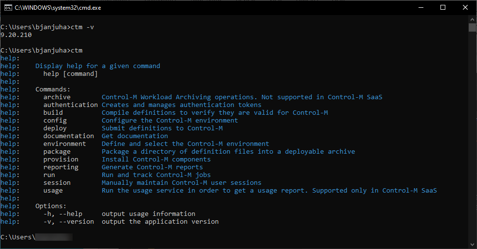

<h1>Introduction & Welcome</h1>
Welcome to the Control-M Automation API Starter Workshop. To enable you to carry out the exercises, your instructor will provide you with a userid, password and a URL to login into the Control-M environment.
This is where you will be walking through each of the labs that we have setup for you.
<br></br>
<h1>Lab 01- Confirm Environment Setup</h1>

This exercise we will walk through testing the Automation API CLI (AAPI CLI) installation and setup to ensure your environment is ready to build workflows in the upcoming labs. It has 3 steps:

 **Step 1. Clone and use the repository - Instructor Led**

 **Step 2. Define and set a Control-M environment**
 
 **Step 3. Verify the environment and get a session token**


 You will need the following:

   1. Email that was sent to you prior to the session with your unique CTM and VSC access links:
   - **Application: Control-M Web Interface** - your unique CTM access link
   -   URL1: https://mobility255-tdctm.trybmc.com/
   - **Application: VS Code Server** - your unique VSC access link
   -   URL1: https://mobility255-tdvscode.trybmc.com/

   2. You will also need the following URL:
   -  https://ctm-git.trybmc.com/automation-api-tech-day-customer-repository/aapi-starter-bronze

**Step 1 - Cloning and use the repository - Instructor led**

* Open your unique VSC link, e.g. https://mobility255-tdvscode.trybmc.com/
* The password is **password**
* To clone: 

**Option 1)** 
-  Select the hamburger icon on the top left -> Terminal -> New Terminal Window
-  This will provide a terminal session below your editor window
-  type "cd /config/"
-  Type: git clone https://ctm-git.trybmc.com/automation-api-tech-day-customer-repository/aapi-starter-bronze/
-  Then use: Hamburger -> File -> Open Folder - /config/ will automatically be selected, hit the ok button

**Option 2)**
- Select the three horizontal lines on the top left -> Terminal -> New Terminal Window
- type: git clone https://ctm-git.trybmc.com/automation-api-tech-day-customer-repository/aapi-starter-bronze/ -this is case sensitive

* You will be required to review the instructions and lab sessions, therefore using your own Web Browser, please navigate to:
https://ctm-git.trybmc.com/automation-api-tech-day-customer-repository/aapi-starter-bronze

**Step 2 - Define and set a Control-M environment**

Run the following command
```
ctm
```

* Once you have a response like the above image, run the following command to obtain the version number of the CLI AAPI

```
ctm -v
```

The output should comeback with a version number, for example:

```
9.20.2xx
```
Now we are going to setup the Automation API endpoint to access the backend Control-M services. Locate your unique CTM link that was sent to you prior to this session. Copy the URL for the AAPI, for example:

AAPI URL: https://mobility255-tdctm.trybmc.com

**NOTE: This will be diferent for all users**

Check if any environments exist:

`ctm env show`

If a 'test' environment already exists, you will have to delete it first

`ctm env del test`

Now you will create a new environment called 'devEnvironment', now copy and paste your unique URL above into the command line below:

`ctm env add devEnvironment https://mobility255-tdctm.trybmc.com/automation-api user01 password`

Please Note: That you must specify "devEnvironment" exactly how it is written otherwise there maybe issues moving forward.
This should return:
```
Environment 'devEnvironment' was created
devEnvironment: {"endPoint":"https://mobility255-tdctm.trybmc.com:443/automation-api","user":"user01"}
```

**Step 3 - Verify the environment and get a session token**

We now need to ensure that we have access to the backend Control-M AAPI Service.
To do this we must ensure that we have our environment connected and authenticated to the backend Control-M AAPI service.
Run the following command:

`ctm env show`

This should return
```
current environment: devEnvironment
environments: {
  "devEnvironment": {
    "endPoint": "https://mobility255-tdctm.trybmc.com:443/automation-api",
    "user": "user01"
  }
}
```
The command now ensures that we have the correct 'plumbing' in place to talk to our backend Control-M AAPI service.

**Step 3 - Verify the environment and get a session token**

The next thing is to obtain a token so that we do not need to constantly authenticate to the Control-M AAPI Service. Run the following command:

`ctm session login`

This should return
```
{
  "username": "<YOUR_USERNAME>",
  "token": "<USER_TOKEN_VERY_LONG_KEY>",
  "version": "9.20.210"
}
```
We are now sucessfully authenticated and we are now ready to move onto Lab 02.
