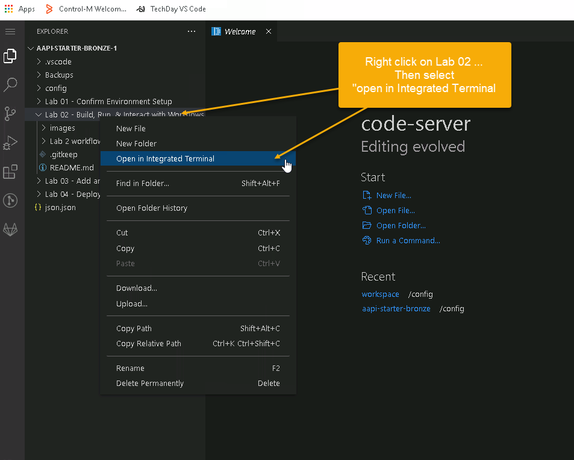
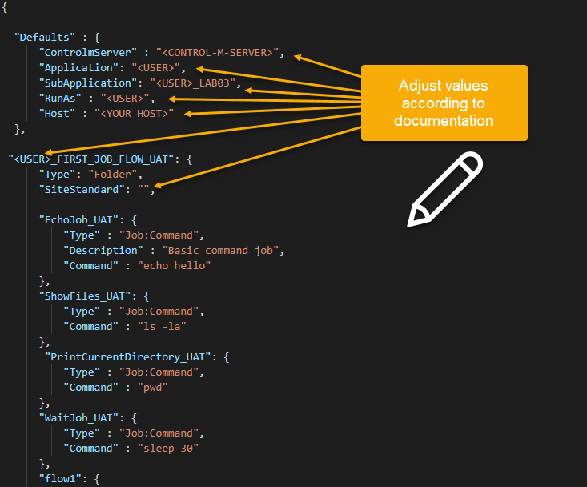
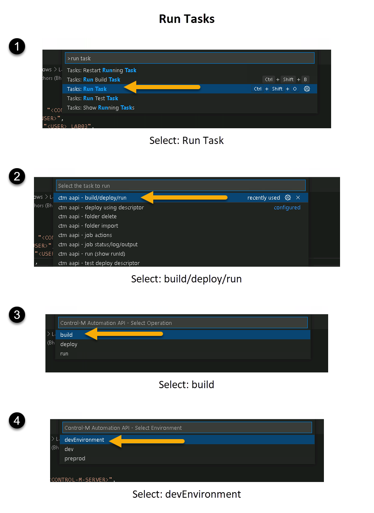
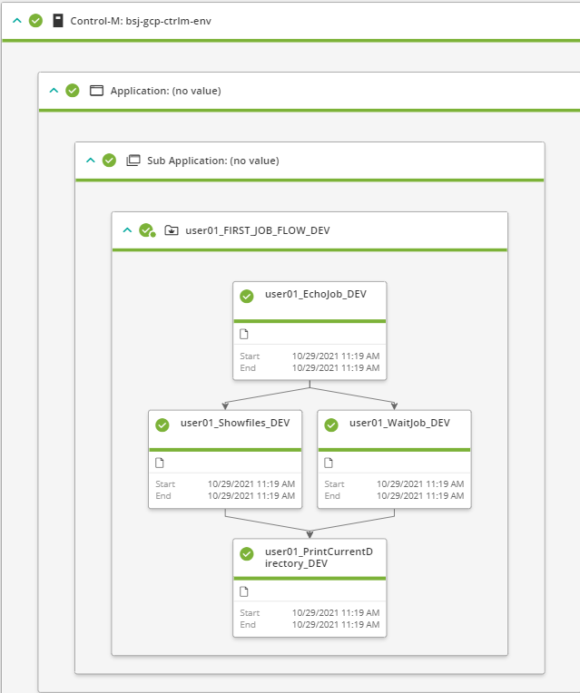

<h1>Lab 2 - Build, Run, & Interact with Workflows</h1>
This exercise we will walk through:

1. Modifying, building and running the JSON code
2. View the status, output and logfiles

**Step 1 - Modify, build, and run JSON code**

We are now going to review, edit and deploy our first workflow using the AAPI services.

Close all open windows in the VSC environment and navigate to the "Lab 02 - Build, Run, & Interact with Workflows" folder. Then:
* Right click, then select open in intergrated terminal
* This will provide a terminal session below you editor window




Now open the LAB02_MY_FIRST_WORKFLOW.json file. Review the JSON code. You will see the following parameters need to be updated to reflect your username and environment.

1. \<CONTROL-M-SERVER> = bdcctm
2. \<USER> = user01
3. \<YOUR_HOST> = bdcctm
4. SiteStandard = techday_std

You can use the VSC IDE to manipulate the code. Once you are happy, save the code.



Click inside your IDE window that reflects the JSON file you have just updated. Press F1 and then enter inside the text box, build task. Select the build task and you should then successfully validate the code you have just updated.

You are looking for the following text in your Terminal Window, this will ensure that the code has been successfully built.

```
[
  {
    "deploymentFile": "LAB02_MY_FIRST_WORKFLOW.json",
    "successfulFoldersCount": 0,
    "successfulSmartFoldersCount": 1,
    "successfulSubFoldersCount": 0,
    "successfulJobsCount": 4,
    "successfulConnectionProfilesCount": 0,
    "successfulDriversCount": 0,
    "isDeployDescriptorValid": false
  }
]
```
If you do not get the above message, then you have not carried out the instructions and may need help from your instructor.

Now lets run the workflow.

Click in the JSON code window. Press F1 and enter in "Run Task", follow the procedure in the image below.



You should see the following in your Terminal Window:
```
{
  "runId": "184c7c45-3405-4ef5-83d7-9ca606961dd4",
  "statusURI": "https://mobility310-tdctm.trybmc.com:443/automation-api/run/status/184c7c45-3405-4ef5-83d7-9ca606961dd4"
}
```
This means that the JSON workflow has been successfully dispatched to Control-M for execution. 

**Step 2 - View Status, Output and Log**

Lets now run the code in Control-M. For this you will need to open up a Control-M Web session. You will need to update the URL below to your URL that was provided prior to the session via email. Open your browser and type in your Control-M Web Interface URL, for example:

```
https://mobility310-tdctm.trybmc.com/ControlM
```
Login using your username and password that you originally used to login to the environment. Go back to your VSC IDE.
Go to the Control-M Web GUI and select the Monitoring domain and select "Add Viewpoint". Enter in "user01" in the Folder name. This will automatically populate your your first workflow name, that is, user01_FIRST_JOB_FLOW. Select your job  name and then press open at the bottom of the screen. This will show you your execution state of your job run.
The results should resemble the following image:



In order to monitor the status of the workflow, you have some options:
1. Use the Control-M Web Interface via the monitoring domain to review the status and output logs. This is as per the above image.
2. Use the Terminal and run the following command:

```
ctm run status <RUN_ID>
In my case, grab the "runId": "_184c7c45-3405-4ef5-83d7-9ca606961dd4_":

    ctm run status 184c7c45-3405-4ef5-83d7-9ca606961dd4
    The output:
    PS C:\Git Repo\aapi-starter-bronze> ctm run status 184c7c45-3405-4ef5-83d7-9ca606961dd4
```
  The output will produce a long listing of each job and the jobid. You can then apply the 'JOB ID' to the commands below.

```
ctm run job:status::get <JOB ID>
ctm run job:output::get <JOB ID>
ctm run job:log::get <JOB ID>
ctm run job::rerun <JOB ID>
```
