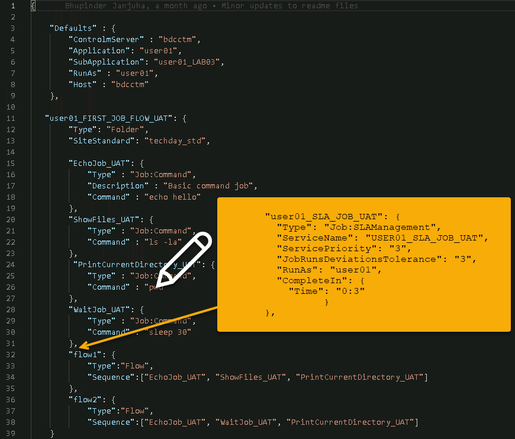
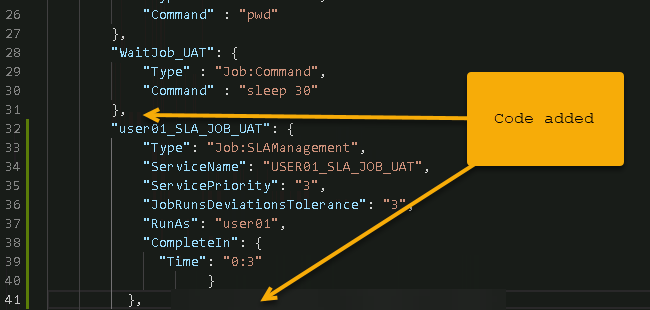
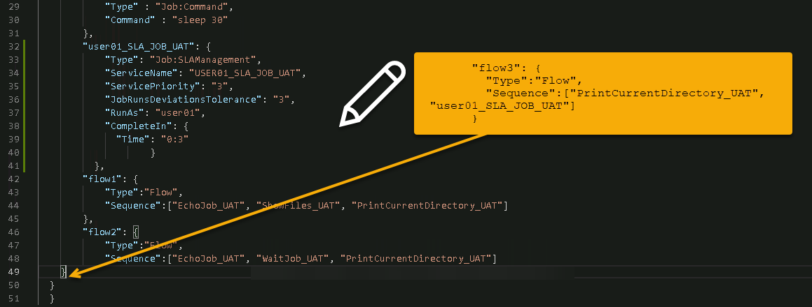
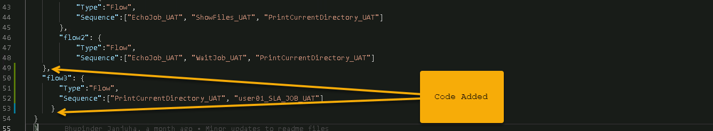
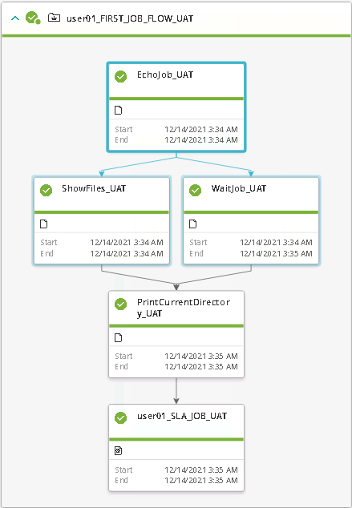
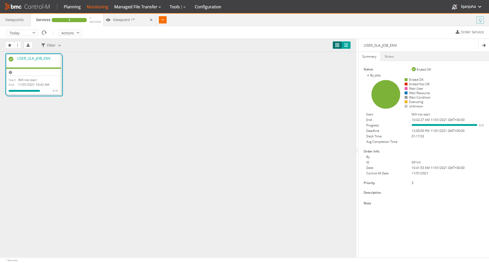

<h1>Lab 3 - Add an SLA Job</h1>
This exercise we will walk through:

1. Insert an SLA job and dependency
2. Vailidate the workflow
3. Run the Workflow
4. Monitor the SLA job via the Service Monitor

**Step 1 - Insert an SLA job and dependency**

Close all open windows in the VSC environment and navigate to the "Lab 03 - Add an SLA Job Type" folder. Then:
* Right click, then select open in intergrated terminal
* This will provide a terminal session below you editor window

Open LAB03_MY_FIRST_WORKFLOW.json

Using your editor, you will note that you have line numbers on the left hand side that represents each line of the code.
At line 31, goto the end of the line and press \<CR>. Then copy and paste the following code snippet or type it into your VSC IDE. (See Image)

```
      "user01_SLA_JOB_UAT": {
        "Type": "Job:SLAManagement",
        "ServiceName": "USER01_SLA_JOB_UAT",
        "ServicePriority": "3",
        "JobRunsDeviationsTolerance": "3",
        "RunAs": "user01",
        "CompleteIn": {
          "Time": "0:3"
                }
      },      
```





We now need to add a dependency in order to ensure that our SLA job monitors the workflow entirely. We now need to move to the end of "flow2" (now line 49), enter in a comma, or as we know it a continuation and hit \<CR>
Copy the code below and paste it at line 49 (see image)
```
      "flow3": {
        "Type":"Flow",
        "Sequence":["PrintCurrentDirectory_UAT", "user01_SLA_JOB_UAT"]
      }
```


Save the code. It should now look like the following image:



**Step 2 - Valiidate the Workflow**

Press F1 and then enter build task. Select the build task option and you will see that the code will now be validated. Upon successful validation you will receive the following output in the terminal window.
```
[
  {
    "deploymentFile": "LAB02_MY_FIRST_WORKFLOW.json",
    "successfulFoldersCount": 0,
    "successfulSmartFoldersCount": 1,
    "successfulSubFoldersCount": 0,
    "successfulJobsCount": 5,
    "successfulConnectionProfilesCount": 0,
    "successfulDriversCount": 0,
    "isDeployDescriptorValid": false
  }
]
```
**Step 3 - Run the Workflow**

You are now ready to run the workflow. Press F1 and then select run task. You should see the following output in your terminal window:
```
{
  "runId": "91bd9998-554c-494c-b4ef-c04f74116b32",
  "statusURI": "https://mobility310-tdctm.trybmc.com/automation-api/run/status/91bd9998-554c-494c-b4ef-c04f74116b32"
}
```
Please use the Web Control-M GUI to monitor the workflow.

**Step 4 - Monitor the SLA Service and Workflow**

Once you have run the workflow, you should now see the following output:



You can see that the SLA job together with its dependencies have been added to the workflow.



Under the services tab, you should now see the SLA Service that will show you whether the SLA has been met or failed. In this instance you can see that the workflow completed within the defined timeframe.
